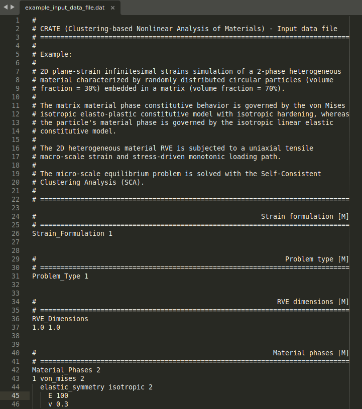

<p align="center">
  <a href=""></a>
</p>

# What is CRATE?

### Summary
**CRATE** (Clustering-based Nonlinear Analysis of Materials) is a Python program developed in the context of computational mechanics to aid the design and development of new materials. Its main purpose is **performing multi-scale nonlinear analyses of heterogeneous materials** through a suitable coupling between first-order computational homogenization and clustering-based reduced-order modeling.

### Authorship & Citation
CRATE's initial version (1.0.0) was originally developed by Bernardo P. Ferreira<sup>[1](#f1)</sup> in the context of his PhD Thesis<sup>[2](#f2)</sup>.

If you use CRATE in a scientific publication, it is appreciated that you cite this [paper]().

<sup id="f1"> 1 </sup> Profile: [LinkedIN](https://www.linkedin.com/in/bpferreira/), [ORCID](https://orcid.org/0000-0001-5956-3877), [ResearchGate](https://www.researchgate.net/profile/Bernardo-Ferreira-11?ev=hdr_xprf)

<sup id="f2"> 2 </sup> Ferreira, B.P. (2022). *Towards Data-driven Multi-scale Optimization of Thermoplastic Blends: Microstructural Generation, Constitutive Development and Clustering-based Reduced-Order Modeling.* PhD Thesis, University of Porto (see [here](https://repositorio-aberto.up.pt/handle/10216/146900?locale=en))


### Conceptual map
CRATE's conceptual structure can be easily understood by getting familiar with some fundamental concepts and having a basic comprehension of a first-order multi-scale modeling scheme.

Assume that we are interested in predicting the behavior of a fiber-reinforced composite (heterogeneous) material composed of two different material phases (matrix and fiber). At the micro-scale level, the composite material needs to be first characterized by a **Representative Volume Element (RVE)**, i.e., a volume of material sufficient large such that it contains enough morphological and topological information to be representative in an average sense. Given the enforcement of periodic boundary conditions in the material analysis, the RVE is assumed periodic. In the second place, the RVE needs to be spatially discretized in a regular (or uniform) grid of voxels, where each voxel is associated with a given material phase. Finally, the RVE model can be compressed by means of a clustering-based domain decomposition, i.e., a cluster analysis that decomposes the spatial domain into a given number of material clusters according to a given set of features. The compressed model is then called **Cluster-reduced Representative Volume Element (CRVE)**, composed of **cluster-reduced material phases (CRMPs)**, each composed of different material clusters. Each **material cluster** is, therefore, a group of voxels that exhibit some type of similarity and that are numerically handled in a unified way.

<p align="center">
  <a href=""></a>
</p>

The multi-scale analysis of a uniaxial tensile test of a dogbone specimen is schematically illustrated below. Besides the **spatially discretized RVE** of the fiber-reinforced composite, CRATE receives as input data a given **macro-scale strain and/or stress loading path**, i.e., a given set of macro-scale first-order homogeneous loading constraints. A two-stage **clustering-based reduced-order method** is then employed to solve the micro-scale equilibrium problem. In the so-called offline-stage, the RVE is compressed into the CRVE by means of a clustering-based domain decomposition. In the following online-stage, the CRVE is subject to the macro-scale loading path and the micro-scale equilibrium problem is solved under periodic boundary conditions. The **macro-scale material response** is then computed by means of computational homogenization, rendering the main output data of CRATE.

<p align="center">
  <a href=""></a>
</p>


### Computational framework

CRATE is designed and implemented in **Python**, making it easily portable between all major computer platforms, easily integrated with
other softwares implemented in different programming languages and benefiting from an extensive collection of prebuilt (standard library) and third-party libraries. Given the extensive numerical nature of the program, its implementation relies heavily on the well-known [NumPy](https://numpy.org/devdocs/index.html) and [SciPy](https://www.scipy.org/) scientific computing packages, being most numerical tasks dispatched to compiled C code inside the Python interpreter.

Moreover, it is worth remarking that CRATE is implemented in a high-modular architecture and following an **object-oriented programming (OOP)** paradigm. Besides improving the overall readability and comprehension of the code, this means that CRATE can be easily extended by means of suitable interfaces to account for new features and developments, as well as being efficiently coupled with other softwares. CRATE's OOP structure is described through the well-known Unified Modeling Language (UML), a language-independent abstract schematic toolkit that allows the visual representation of object-oriented programs. In particular, the so-called UML class diagrams are employed to represent the most important classes of CRATE along with the interactions and relationships between them.


# Installation (WIP)

CRATE is a simple **Python package** - [crate]() - available from the Python Package Index ([PyPI](https://pypi.org/)). This means that running CRATE requires solely a Python 3.X installation and a few Python packages used for scientific computing and data science:

- Whether you are using Linux, MacOS or Windows, Python can be easily installed by following the [Python Getting Started](https://www.python.org/about/gettingstarted/) official webpage. Many other resources are available to help you install and setup Python (e.g., [Real Python](https://realpython.com/installing-python/)).

- CRATE can be installed either through **pip** (recommended) or **from source**:

    - [**pip**](https://pip.pypa.io/en/stable/getting-started/) is a Python package manager that installs Python packages from PyPI. After [installing pip](https://pip.pypa.io/en/stable/installation/), installing a package is straightforward as described [here](https://packaging.python.org/en/latest/tutorials/installing-packages/) and [here](https://pip.pypa.io/en/stable/getting-started/). Note that, besides installing CRATE, pip automatically installs all the required Python package dependencies. Therefore, CRATE can be simply installed by running the following pip installation command:

        > pip install crate

    - CRATE can be installed directly by [git](https://git-scm.com/) cloning the [GitHub repository]() into a local directory. In this case, all the required Python package dependencies must be installed manually.


# How to use CRATE? (WIP)

Performing a multi-scale simulation with CRATE involves setting a **user-defined input data file**, which contains all the required data about the problem and the simulation procedure itself, and **running CRATE's main script**, which carries out all the simulation operations automatically.

The **general workflow of CRATE** in the solution of a micro-scale equilibrium problem entails **4 different steps** described as follows:

- **Step 1 (Input Data): Generate Representative Volume Element (RVE).**

    * The first step consists in the computational generation of a RVE of the heterogeneous material under analysis;

    * The RVE must be quadrilateral (2d) or paralelepipedic (3d);

    * The RVE must be spatially discretized in a regular (or uniform) grid of voxels, where each voxel is associated with a given material phase as illustrated below;
    <p align="center">
  <a href=""></a>
    </p>

    * The **spatial discretization file (`.rgmsh` file)** that is ultimately provided to CRATE as part of the input data must be generated with [NumPy](https://numpy.org/devdocs/index.html) as illustrated in the following Python (pseudo-)script:
    <br/><br/>

    ```python
    import numpy as np

    # The RVE discretization in a regular grid of voxels (2d or 3d), where each voxel
    # is associated with a given material phase, must be materialized as a NumPy ndarray
    # (2d or 3d), where each entry corresponds to a given voxel. Hence, each entry of the
    # ndarray contains the identifier (integer) of the corresponding voxel's material phase.
    # Assume that the ndarray is called `regular_grid`.
    regular_grid = ...

    # The spatial discretization file (.rgmsh) is then generated by saving the `regular_grid`
    # ndarray in binary format through the NumPy save function. Note that this appends the
    # .npy extension to the filename.
    np.save('example_rve.rgmsh', regular_grid)

    # Output: example_rve.rgmsh.npy file
    ```

- **Step 2 (Input Data): Set CRATE's user-defined input data file.**

    * The second step consists in defining a **CRATE's user-defined input data file (`.dat` file)**;

    * The input data file contains all the required information about the problem (problem type, material properties, macro-scale loading path, ...) and about the solution procedure (macro-scale loading incrementation, clustering-based domain decomposition, output options, ...). The **spatial discretization file (`.rgmsh` file)** path is provided in the input data file;

    * A complete **CRATE's user-defined input data file (`.dat` file)** template, where each available keyword specification (mandatory or optional) is fully documented, can be found [here](https://github.com/BernardoFerreira/CRATE/blob/PRv1.0.0-package-structure/src/crate/input_data_file_template.dat). This template file can be copied to a given local simulation directory and be readily used by replacing the `[insert here]` boxes with the suitable specification!

<p align="center">
  <a href=""></a>
</p>

- **Step 3: (Execution) Run CRATE simulator.**

    * The third step consists in running CRATE to perform the numerical simulation;

    * Running CRATE is a single-liner as illustrated in the following Python (pseudo-)script:
    <br/><br/>

    ```python
    import crate

    # Set input data file path (mandatory)
    input_data_file_path = ...

    # Set spatial discretization file directory path (optional). If the spatial discretization
    # file path specific in the input data file is not absolute, then it is assumed to be
    # relative to the provided spatial discretization file directory
    discret_file_dir = ...

    # Perform numerical simulation
    crate.crate_simulator(input_data_file_path, discret_file_dir=discret_file_dir)
    ```

    * The program execution can be monitored in real-time in the terminal console window where the previous script is run. Display data includes program launching information, a detailed description of the different simulation phases, and a execution summary when the program is successfully completed.

<p align="center">
  <a href=""></a>
</p>

- **Step 4 (Output): Post-process results.**

    * The fourth-step consists in post-processing the simulation results;

    * CRATE generates several output files during running time that are collectively stored in a single output directory created in the same path and sharing the same name as the input data file. Among these output files, three are particularly useful:

        - `.screen` file - A log file where all the data displayed in the default standard output device is stored;

        - `.hres` file - A file where the macro-scale material response is stored, i.e., the homogenized stress-strain response of the RVE computed at every macro-scale loading increment;

        - `.vti` file - A VTK XML output file associated with a given macro-scale loading increment that allows the RVE relevant physical data to be conveniently analyzed with a suitable visualization software (e.g. [ParaView](https://www.paraview.org/)).


<p align="center">
  <a href=""></a>
</p>

<p align="center">
  <a href=""></a>
</p>

# What comes in the box?

Below is a summary of the **main features** that CRATE has to offer regarding the computational simulation of materials.

### General formulation:
* Quasi-static deformation process;
* Infinitesimal and finite strains;
* Implicit time integration.

### Macro-scale loading path:
* General monotonic and non-monotonic macro-scale loading paths;
* Enforcement of macro-scale strain and/or stress constraints;
* General prescription of macro-scale loading incrementation;
* Dynamic macro-scale loading subincrementation.

### Material constitutive modeling:
* General nonlinear material constitutive behavior;
* Interface to implement a new constitutive model;
* Admits three different families of constitutive models:
  - Infinitesimal strains constitutive models;
  - Finite strains constitutive models;
  - Finite strains constitutive models whose implementation stems from a purely kinematical extension of their infinitesimal counterpart;
* Available computational solid mechanics common procedures;
* Suitable toolkit of tensorial and matricial operations;
* Out-of-the-box constitutive models include:
  - General anisotropic linear elastic constitutive model (infinitesimal strains);
  - von Mises elasto-plastic constitutive model with isotropic strain hardening (infinitesimal and finite strains);
  - General anisotropic Hencky hyperelastic constitutive model (finite strains);
  - General anisotropic St.Venant-Kirchhoff hyperelastic constitutive model (finite strains).

### Offline-stage DNS methods:
* Interface to implement any direct numerical simulation (DNS) homogenization-based multi-scale method;
* FFT-based homogenization basic scheme ([article](https://www.sciencedirect.com/science/article/pii/S0045782597002181), [article](https://link.springer.com/article/10.1007/s00466-014-1071-8)).

### Offline-stage clustering methods:
* Interface to implement any clustering algorithm;
* Wrappers over clustering algorithms available from third-party libraries (e.g., [SciPy](https://docs.scipy.org/doc/scipy/reference/cluster.html), [Scikit-Learn](https://scikit-learn.org/stable/modules/clustering.html), ...).

### Online-stage clustering-based reduced-order models:
* Self-Consistent Clustering Analysis (SCA) ([article](https://www.sciencedirect.com/science/article/pii/S0045782516301499));
* Adaptive Self-Consistent Clustering Analysis (ASCA) ([article](https://www.sciencedirect.com/science/article/pii/S0045782522000895)).

### Post-processing:
* VTK (XML format) output files allowing the visualization of data associated to the material microstructure (topoloy, material phases, material clusters) and micro-scale physical fields (strain, stress, internal variables, ...).

# Credits

* Bernardo P. Ferreira is deeply thankful to [Francisco Pires](https://sigarra.up.pt/feup/pt/func_geral.formview?p_codigo=240385) and [Miguel Bessa](https://github.com/mabessa) for supervising the PhD Thesis that motivated the development of CRATE.


# License

Copyright 2020, Bernardo Ferreira

All rights reserved.

CRATE is a free and open-source software published under a BSD 3-Clause License.
