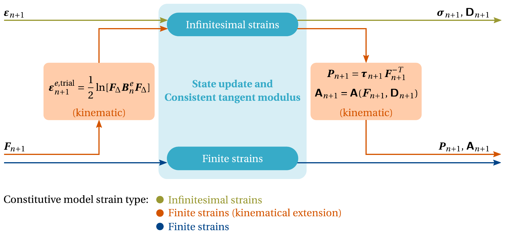

Interface: Constitutive model
=============================

Context
-------
One of the most important ingredients to perform the multi-scale simulation of a heterogeneous material is the set of constitutive models adopted to mathematically describe the physical behavior of each material phase. In a mechanical setting, a **constitutive model** is essentially a given set of equations, usually called constitutive equations, that establishes the relation between strain and stress on a given material point.

.. note::
   For a fundamental background on continuum mechanics and the formulation of the mechanical constitutive initial value problem, the interested reader is referred to `Ferreira (2022) <http://dx.doi.org/10.13140/RG.2.2.33940.17289>`_ (see Chapter 2: 2.1-2.9) and references therein.

Therefore, given a particular application, it is often the case that specific constitutive models must be implemented to describe the behavior of the different material phases composing the RVE of the material of interest.

----

Constitutive framework and requirements
---------------------------------------
CRATE constitutive modeling implementation is designed (but not limited to) around a particular case of the general history functional-based constitutive theory named **thermodynamics with internal variables**. Such a framework admits the implementation of a broad spectrum of general nonlinear constitutive models where (i) the thermodynamic state at a given instant of the deformation process is assumed to be completely defined by the instantaneous values of a finite number of state variables, and (ii) a given set of internal variables contains all the relevant information about the material thermodynamical history. Moreover, CRATE assumes an **implicit time integration scheme** and adopts an integration algorithm based on approximated **incremental constitutive functions**. Therefore, the implementation of a constitutive model requires not only the **state update** procedure, i.e., the incremental update of stress and state variables according to the constitutive equations, but also the computation of the **material consistent tangent modulus**, which arises in the linearization of the macro-scale equilibrium problem.

In this context, the implementation of a particular constitutive model in CRATE requires that the following elements are clearly defined beforehand:

* **Model name** - A unique identifier of the constitutive model;

* **Constitutive strain formulation** - Closely following the classification described by de Souza Neto and coworkers (`de Souza Neto (2022) <https://onlinelibrary.wiley.com/doi/book/10.1002/9780470694626>`_), CRATE distinguishes three different families of constitutive models (see illustration below): (i) infinitesimal strains, (ii) finite strains, and (iii) finite strains (kinematical extension);

* **Material properties** - A set of material properties and/or hyperparameters that tune the constitutive model for a particular material;

* **Constitutive state update** - The computational implementation of the model constitutive equations that, given the material thermodynamical history, uniquely determine the updated values of stress and internal variables for a given prescribed strain;

* **Material consistent tangent modulus** - The computational implementation of the model material consistent tangent modulus, i.e., the first-order derivative of stress incremental constitutive function with respect to strain.

----

Implementation steps
--------------------
The implementation of a new constitutive model in CRATE involves **four fundamental steps**:

* **Step 1** - Create a Python module with the name of the new constitutive model (e.g., :code:`new_model.py`) in :py:mod:`crate.material.models` directory;

* **Step 2** - In :code:`new_model.py`, import the constitutive model interface (:py:class:`~crate.material.models.interface.ConstitutiveModel`), derive a class for the new constitutive model (e.g., :code:`NewConstitutiveModel`), and set the constitutive model name as an attribute (e.g., :code:`new_constitutive_model`):

    .. code-block:: python

       # material.models.new_model.py

       from material.models.interface import ConstitutiveModel

       class NewConstitutiveModel(ConstitutiveModel):
           """New constitutive model.

           Attributes
           ----------
           _name : str
               Constitutive model name.
           """
           def __init__(self, strain_formulation, problem_type, material_properties):
               """Constructor."""

               self._name = 'new_constitutive_model'

* **Step 3** - In :py:mod:`crate.material.materialmodeling`, import and add the initialization of the new constitutive model in the :py:meth:`~crate.material.materialmodeling.MaterialState.init_constitutive_model` method of class :py:class:`~crate.material.materialmodeling.MaterialState`:

    .. code-block:: python
       :emphasize-lines: 3, 14-17

       # crate.material.materialmodeling.py

       from material.models.new_model import NewConstitutiveModel

       class MaterialState:
           """CRVE material constitutive state."""

           def init_constitutive_model(self, mat_phase, model_keyword,
                                       model_source='crate'):
               """Initialize material phase constitutive model."""

               # Initialize material phase constitutive model
               if model_source == 'crate':
                   if model_keyword == 'new_model':
                       constitutive_model = NewConstitutiveModel(
                           self._strain_formulation, self._problem_type,
                           self._material_phases_properties[mat_phase])
                   else:
                       raise RuntimeError('Unknown constitutive model from CRATE\'s '
                                          'source.')

* **Step 4** - Perform the complete implementation of the new constitutive model in :code:`new_model.py` by developing the class :code:`NewConstitutiveModel` and implementing the abstract methods (look for the @abstractmethod decorator) established by the constitutive model interface (:py:class:`~crate.material.models.interface.ConstitutiveModel`).

----

Recommendations
---------------

* If you are not familiar with the implementation of a constitutive model in CRATE, it is recommended that you first take a look into the implementation of the constitutive models already available (:py:mod:`crate.material.models`). The implementation of these models follows the steps previously outlined and are fully documented;

* Focus on the essential and don't lose time implementing standard computations and operations in solid mechanics - make use of the extensive set of tools available in :py:mod:`crate.material.materialoperations` and :py:mod:`crate.tensor.tensoroperations`;

* Avoid troublesome debugging processes by taking advantage of the matricial storage procedures of strain and stress related tensors available in :py:mod:`crate.tensor.matrixoperations` - such a toolkit ensures a systematic and consistent way of performing all the conversions between tensorial and matricial forms arising in your implementation.
