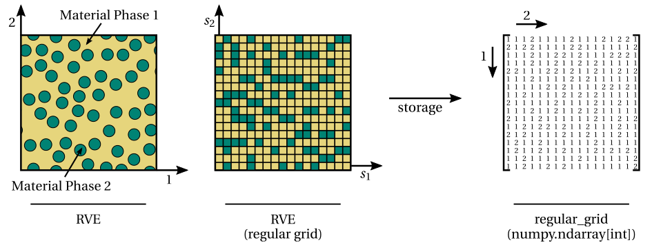

Step 1: Material model
======================

The first step to perform a CRATE simulation is to **generate a suitable computational model** that characterizes the microstructure of the heterogeneous material under analysis.

Attending to the concepts introduced :doc:`here<../getting_started/overview>`, such a computational model is named **Representative Volume Element (RVE)** and can be obtained in two different ways:

* **Experimentally**. Through a suitable microstructure imaging method (e.g., two-dimensional scanning electron microscopy (SEM), three-dimensional micro-computed tomography (:math:`{\mu}` CT));

* **Computationally**. Adopting a suitable computational generation method (e.g., `AMINO <http://dx.doi.org/10.1016/j.mechmat.2021.104069>`_ for particle-reinforced materials, `NEPER <https://neper.info/index.html>`_ for polycrystalline materials).

.. note::
   The generation of the RVE is **not** part of CRATE!

----

CRATE accepts any kind of RVE that satisfies the following **requirements**:

* **Requirement 1**: The RVE must be **quadrilateral** (2d) or **paralelepipedic** (3d);

* **Requirement 2**: The RVE must be spatially discretized in a **regular grid of voxels**, where each voxel is associated with a given material phase as illustrated below:

|

|

* **Requirement 3**: The **RVE spatial discretization file** (:code:`.rgmsh` file) that is ultimately provided to CRATE as part of the input data must be generated with `NumPy <https://numpy.org/devdocs/index.html>`_ as demonstrated and explained in the following Python (pseudo-)script:

  .. code-block:: python

     # python_script.py

     # The RVE discretization in a regular grid of voxels (2d or 3d), where each voxel
     # is associated with a given material phase, must be materialized as a NumPy ndarray
     # (2d or 3d), where each entry corresponds to a given voxel. Hence, each entry of the
     # ndarray contains the identifier (integer) of the corresponding voxel's material phase.
     # Assume that the ndarray is called `regular_grid`.
     regular_grid = ...

     # The spatial discretization file (.rgmsh) is then generated by saving the `regular_grid`
     # ndarray in binary format through the NumPy save function. Note that this appends the
     # .npy extension to the filename.
     np.save('example_rve.rgmsh', regular_grid)

     # Output: example_rve.rgmsh.npy file
